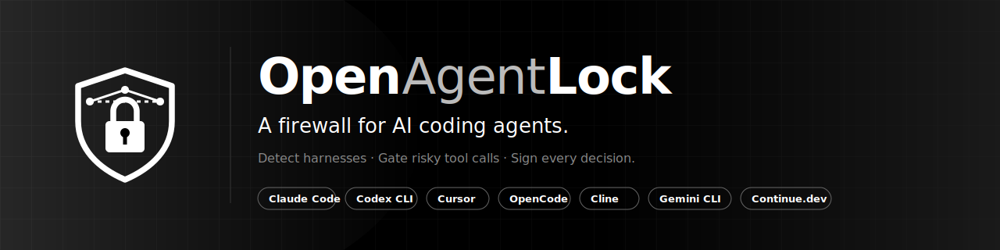
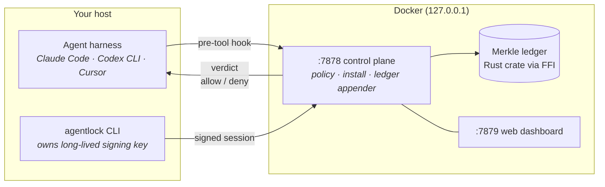

<div align="center">



**A locally-hosted, open-source firewall for AI coding agents.**

[](https://github.com/openagentlock/OpenAgentLock/actions/workflows/ci.yml)
[](https://github.com/openagentlock/OpenAgentLock/actions/workflows/docker-publish.yml)
[](https://www.npmjs.com/package/@openagentlock/cli)
[](https://github.com/openagentlock/OpenAgentLock/pkgs/container/agentlockd)
[](LICENSE)
[](https://openagentlock.github.io/OpenAgentLock/)
[](https://github.com/openagentlock/OpenAgentLock/stargazers)

[Documentation](https://openagentlock.github.io/OpenAgentLock/) · [Getting started](https://openagentlock.github.io/OpenAgentLock/guide/getting-started/) · [Rules registry](https://openagentlock.github.io/rules/) · [Status](https://openagentlock.github.io/OpenAgentLock/status/) · [Architecture](https://openagentlock.github.io/OpenAgentLock/architecture/overview/)

</div>

---

OpenAgentLock detects local AI coding agent harnesses (Claude Code, Codex CLI, Cursor, OpenCode, Cline, Gemini CLI, Continue.dev, VS Code Copilot), gates risky tool calls with a deterministic YAML policy, and anchors every decision in a tamper-evident Merkle ledger. Install once and keep working in your harness as normal — your workflow does not change.

## Quick start

```bash
# 1. Pull and start the daemon
curl -O https://raw.githubusercontent.com/openagentlock/OpenAgentLock/main/docker-compose.yml
docker compose up -d

# 2. Install the CLI
brew install openagentlock/tap/agentlock
# or: bun add -g @openagentlock/cli
# or: npm i -g @openagentlock/cli

# 3. Enroll a signer (TOTP — recommended for prod)
agentlock signer enroll --tier totp --passphrase 'your-passphrase-here'
# scan the otpauth:// QR with Google Authenticator / 1Password / Authy.

# 4. Wire your harnesses with a TOTP-attested session
agentlock detect
agentlock install --tier totp --code 123456 --passphrase 'your-passphrase-here'
```

For a quick eval without a signer (dev only): start the daemon with `-e AGENTLOCK_ALLOW_UNATTESTED=1`, then `agentlock install` (defaults to unattested).

Open the local web dashboard at <http://127.0.0.1:7879/>.

Full walkthrough at <https://openagentlock.github.io/OpenAgentLock/guide/getting-started/>.

## Community rules registry

Need more gates than the five baseline ones? Browse the community catalog at <https://openagentlock.github.io/rules/> — secret reads, force-push to shared branches, network exfil, untrusted eval. Install with one command:

```bash
agentlock rules sync
agentlock rules search exfil
agentlock rules install rogue.secret-read
```

Or run your own private registry — any Git repo with the same layout works. Source: [openagentlock/rules](https://github.com/openagentlock/rules).

For agents that need to **author** new rules from natural-language intent, see [openagentlock/skills](https://github.com/openagentlock/skills) — Claude Code / Cursor / Codex skills that drive the `agentlock rules` CLI.

## What ships today

| Surface | Status |
|---|---|
| `agentlock detect` |  |
| `agentlock install` (Claude Code, Codex CLI, Cursor) |  |
| `agentlock install --tier {unattested,software,totp}` |  |
| `agentlock install` (OpenCode, Cline, Gemini CLI, Continue, VS Code Copilot) |  |
| Five baseline gates in monitor mode |  |
| Tamper-evident Merkle ledger |  |
| Local web dashboard |  |
| Software + TOTP signers (with `signer enroll` + session mint) |  |
| OS keychain signer, hardware-key (YubiKey PIV / FIDO2) |  |
| OIDC SSO + RBAC + LDAP |  |
| Signed PDF audit report |  |

The complete shipped/not-yet matrix lives at <https://openagentlock.github.io/OpenAgentLock/status/>.

## How it works



Three languages, one repo:

- **`cli/`** — TypeScript on Bun, runs on your host. Owns the long-lived signing key.
- **`control-plane/`** — Go HTTP service in Docker. Evaluates policy, drives install plan/apply, appends to ledger.
- **`ledger/`** — Rust crate. Merkle log + verification, exposed to Go via FFI so verification logic exists in exactly one place.

See [Architecture overview](https://openagentlock.github.io/OpenAgentLock/architecture/overview/) for the why behind the split.

## The five gates

Every install ships [`policies/default.yaml`](policies/default.yaml) with five gates in monitor mode:

| Gate | What it catches |
|---|---|
| `supply-chain.pkg-install` | `pip install`, `npm install`, `brew install`, `cargo install` |
| `supply-chain.untrusted-mcp` | MCP server with an unpinned public key |
| `rogue.secret-read` | reads of `.env`, `~/.ssh`, `~/.aws/credentials`, anywhere a secret-shaped path appears |
| `rogue.net-egress` | `curl`, `wget`, MCP HTTP tools |
| `rogue.destructive-bash` | `rm -rf`, `git push --force`, `DROP TABLE`, `kubectl delete` |

See [Policies and the five gates](https://openagentlock.github.io/OpenAgentLock/guide/policies/) for the rule schema and authoring rules.

## Repository layout

```
cli/                        TypeScript + Bun + OpenTUI                — @openagentlock/cli
control-plane/              Go HTTP service in Docker                 — ghcr.io/openagentlock/agentlockd
  api/openapi.yaml          source-of-truth API contract
  Dockerfile, docker-compose.yml
  dashboard-ui/             Vite SPA embedded into the Go binary
ledger/                     Rust crate (lib + cdylib + staticlib)     — openagentlock-ledger
policies/default.yaml       baseline policy shipped with every install
docs/                       MkDocs Material site (deployed to openagentlock.github.io/OpenAgentLock)
assets/                     logo, favicon, social card
Formula/agentlock.rb        Homebrew tap formula
docker-compose.yml          one-command control-plane bring-up
scripts/install.sh          one-shot installer
.github/workflows/          ci · docker-publish · npm-publish · pages
```

## Status

Pre-1.0.

We try not to break anything that already works. Surfaces marked "shipped" have tests; surfaces marked "not yet" exist as scaffolding or stubs and are explicitly disabled in the user-facing path.

## Contributing

See [`CONTRIBUTING.md`](CONTRIBUTING.md) for development setup and the workflow.

By contributing you agree your contributions are licensed under the FSL-1.1-Apache-2.0 found in [`LICENSE`](LICENSE).

We follow the [Contributor Covenant 2.1](CODE_OF_CONDUCT.md). For security disclosures see [`SECURITY.md`](SECURITY.md).

## License

[Functional Source License 1.1, Apache 2.0 Future License](LICENSE) (`FSL-1.1-Apache-2.0`).

Permits any non-competitive use today; auto-converts to Apache 2.0 two years after each release.
