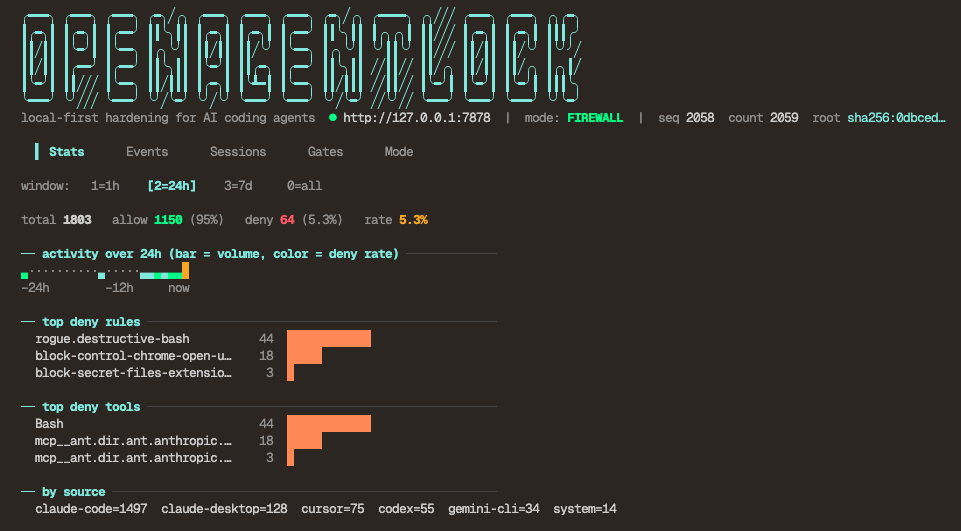

# `@openagentlock/cli`

The `agentlock` CLI — a firewall for AI coding agents.

```bash
bun add -g @openagentlock/cli
# or
npm i -g @openagentlock/cli
```

The CLI talks to a local control plane (Go service in Docker, port 7878). Pull and start the control-plane image:

```bash
docker pull ghcr.io/openagentlock/agentlockd:latest
docker run -d --name agentlock \
  -p 127.0.0.1:7878:7878 \
  -p 127.0.0.1:7879:7879 \
  -v agentlock-state:/var/lib/agentlock \
  ghcr.io/openagentlock/agentlockd:latest
```

Then use the CLI:

```bash
agentlock detect            # list local agent harnesses
agentlock install           # plan + apply hooks for selected harnesses
agentlock status            # control-plane health
agentlock dashboard         # OpenTUI dashboard — live ledger, sessions, gates
agentlock doctor            # read-only daemon, ledger, policy, session, and hook diagnostics
agentlock false-positive 42 # export a redacted case bundle for a matched event
```

<p align="center">
  
</p>

For attested install (TOTP, hardware signers) and policies, see [openagentlock.github.io/OpenAgentLock](https://openagentlock.github.io/OpenAgentLock/).

Full documentation: <https://openagentlock.github.io/OpenAgentLock/>

Source: <https://github.com/openagentlock/OpenAgentLock>

License: FSL-1.1-Apache-2.0 (see repo `LICENSE`).
