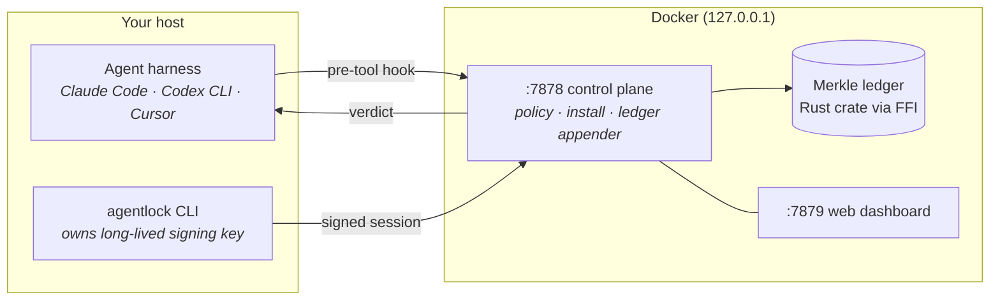

---
hide:
  - navigation
  - toc
---

<div class="oal-hero" markdown>

{ .oal-banner .no-zoom }

<p class="lede" markdown>
Detect local agent harnesses, gate risky tool calls with a deterministic YAML policy, and anchor every decision in a tamper-evident Merkle ledger. Install once and keep working in **Claude Code, Codex CLI, and Cursor** as normal — your workflow does not change.
</p>

[Get started](guide/getting-started.md){ .oal-cta .primary }
[GitHub](https://github.com/openagentlock/OpenAgentLock){ .oal-cta }

</div>

## Why

Coding agents `pip install` dependencies, read `.env` files, push to remotes, and call MCP tools you've never pinned. OpenAgentLock catches those calls at the harness hook layer, applies a deterministic YAML policy, and signs every decision to a local Merkle ledger you can verify after the fact.

## What ships today

<div class="gate-grid" markdown>

<div class="gate-card" markdown>
#### Detection
<span class="gate-id">`agentlock detect`</span>

Eight harness detectors registered: Claude Code, Codex CLI, Cursor, OpenCode, Cline, Continue.dev, Gemini CLI, VS Code Copilot.
</div>

<div class="gate-card" markdown>
#### Install plan / apply
<span class="gate-id">`agentlock install`</span>

Interactive multi-select. Posts to `/v1/install/plan`, renders the diff, applies on confirm. Real install paths live for **Claude Code** (HTTP hooks) and **Codex CLI** (TOML hooks).
</div>

<div class="gate-card" markdown>
#### Five baseline gates
<span class="gate-id">`policies/default.yaml`</span>

Package install, untrusted MCP, secret reads, network egress, destructive bash. Ship in monitor mode by default.
</div>

<div class="gate-card" markdown>
#### Tamper-evident ledger
<span class="gate-id">`/v1/ledger/*`</span>

Rust crate. SHA-256 leaf hashing, Merkle root, inclusion proofs, verification. Ten tests pass.
</div>

<div class="gate-card" markdown>
#### Local web dashboard
<span class="gate-id">`127.0.0.1:7879`</span>

Read logs, author rules, watch live activity. Firewall-admin shape.
</div>

<div class="gate-card" markdown>
#### Signers
<span class="gate-id">`/v1/sessions`</span>

Software (dev/CI) and TOTP shipped. OS keychain and YubiKey land next.
</div>

<div class="gate-card" markdown>
#### Community rules registry
<span class="gate-id">[openagentlock/rules](https://openagentlock.github.io/rules/)</span>

Browse and install community-maintained gates with `agentlock rules install <id>`. Search the catalog at [openagentlock.github.io/rules](https://openagentlock.github.io/rules/) — or point the CLI at any Git repo to run a private registry.
</div>

</div>

## How it works



Three languages, one repo. The CLI runs on your host and owns the YubiKey path. The control plane runs in Docker and evaluates policy. The ledger is a Rust crate linked into Go via FFI so verification logic exists in exactly one place.

## Get started

Three steps:

```bash
# 1. Pull the control-plane image
docker pull ghcr.io/openagentlock/agentlockd:latest

# 2. Start it (drops a docker-compose example in your CWD)
curl -O https://raw.githubusercontent.com/openagentlock/openagentlock/main/docker-compose.yml
docker compose up -d

# 3. Install the CLI and wire up your agents
brew install openagentlock/tap/agentlock
agentlock detect
agentlock install
```

See [Installation](guide/installation.md) for npm, source builds, and platform notes.

## Status

This project is pre-1.0. See the [status page](status.md) for the live shipped/not-yet matrix.
