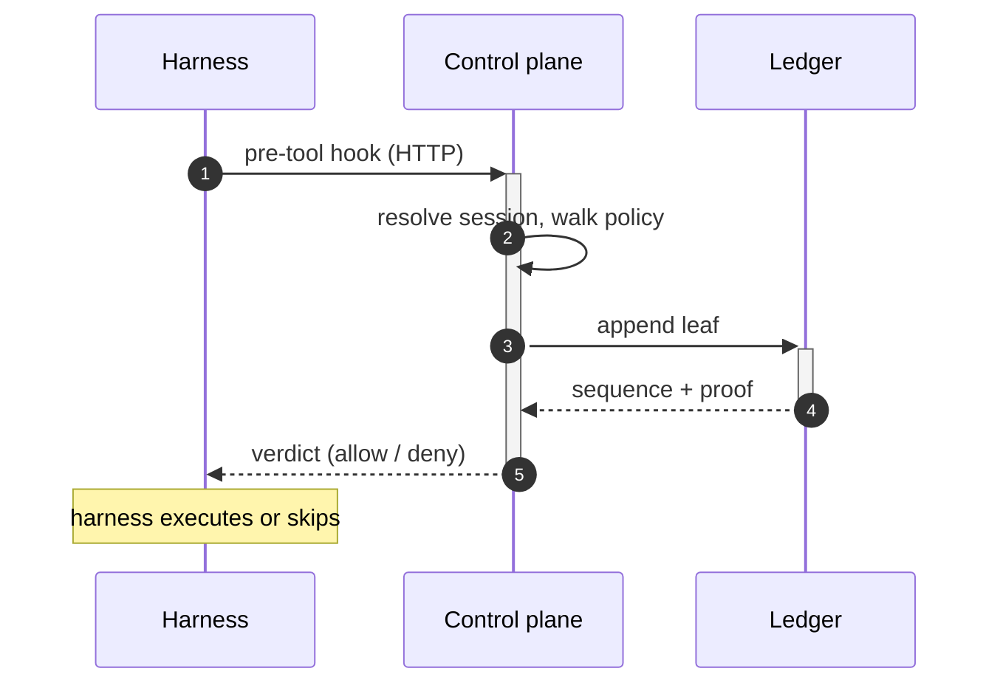
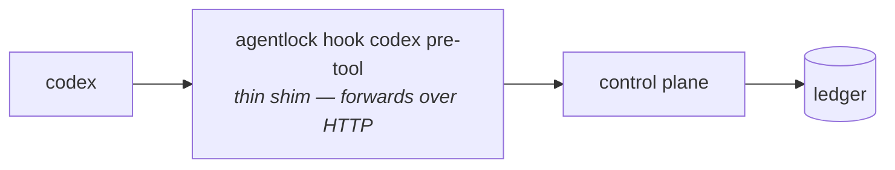

# Hook → daemon path

End-to-end view of what happens when a harness fires a pre-tool hook.

For Codex, the path goes through the `agentlock hook codex` shim:

## Sequence guarantees

1. The ledger append happens **before** the verdict is returned to the harness. There is no window where the call ran but the audit didn't.
2. If the daemon is unreachable, the harness's own hook timeout / failure semantics apply. We do not fail-open in our own code.
3. The verdict carries an `idempotency_token` keyed off `tool_use_id`; replays of the same hook get the same verdict from the same audit row.

## Where to look when something is off

| Symptom | Where |
|---|---|
| Hook seems to fire but no log row | `docker compose logs -f control-plane` — look for 4xx |
| Hook fires but harness behaves like it didn't | check the harness's own hook log; verify settings.json / config.toml |
| Verdict surprises you | dashboard rule tree → click the matching rule for the path-shape it hit |
| Ledger root not advancing | session may be expired; re-run `agentlock signer enroll` or re-authenticate |
